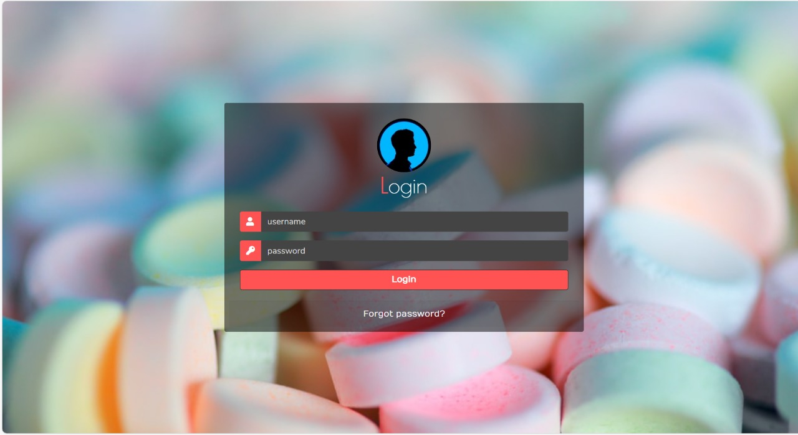
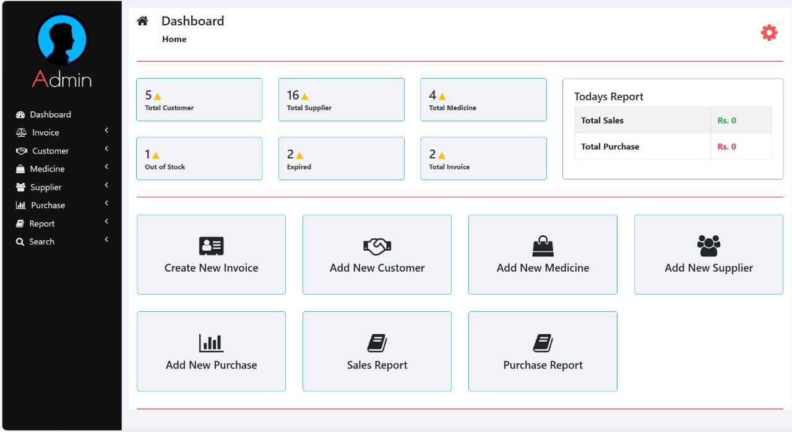
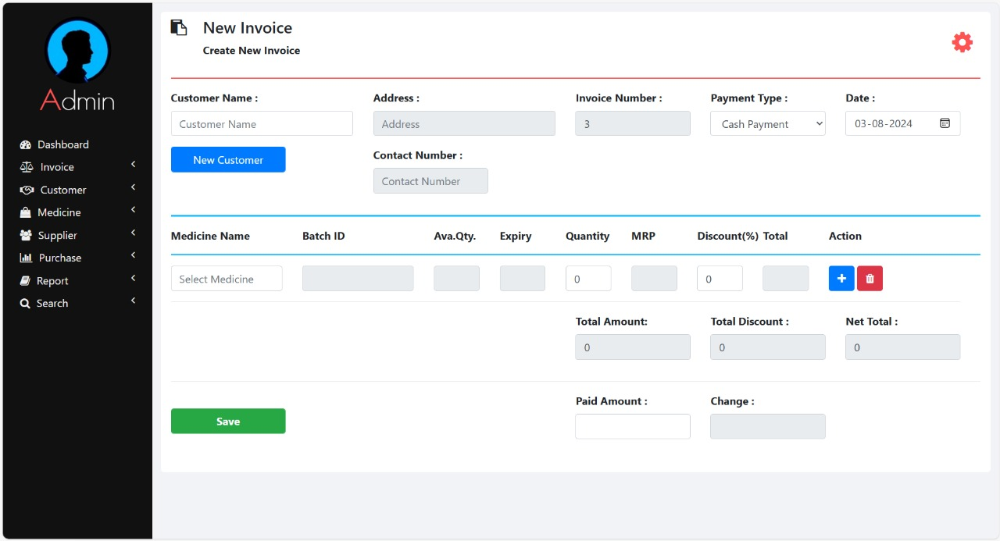
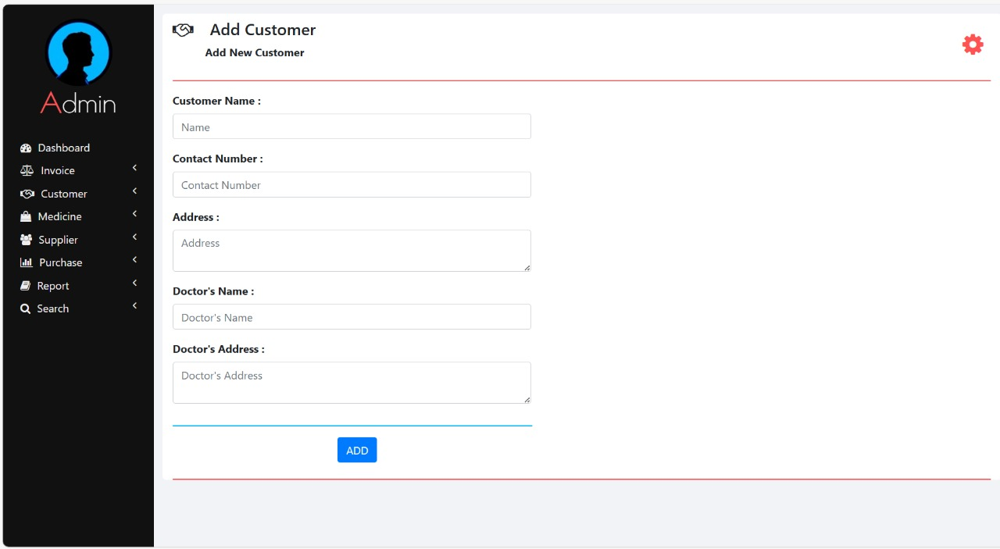
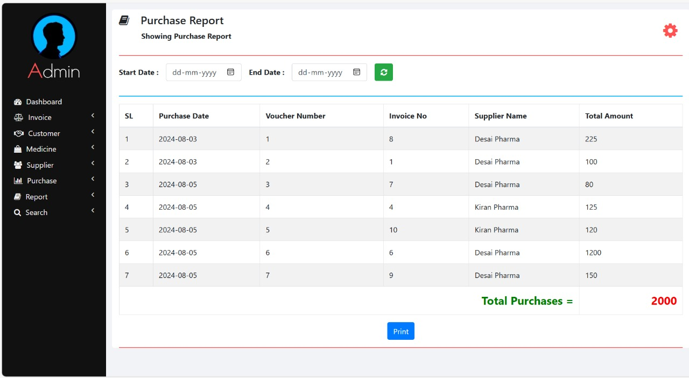

# 💊 Pharmacy Management System

## 📌 Overview
The Pharmacy Management System is a simple and efficient software solution to handle pharmacy operations like managing medicines, suppliers, customers, billing, and generating reports.  
It helps streamline daily workflows, reduce manual errors, and improves record keeping for pharmacies.

---

## 🚀 Key Features
- ✅ Add, update, and delete medicines  
- ✅ Customer and supplier management  
- ✅ Generate invoices and sales reports  
- ✅ Purchase and billing tracking  
- ✅ Stock alerts for low inventory  
- ✅ Clean and user-friendly interface  

---

## 🛠️ Tech Stack
- Frontend / UI: PHP, HTML, CSS, JavaScript  
- Backend: PHP  
- Database: MySQL (`pharmacy.sql`)  

---

## 📖 How to Run

You can view this project on GitHub here:  
🔗 [Visit Repository](https://github.com/likithashreeh10/pharmacy-management-system)

To clone the project locally, use:
## 🛠️ Steps to Run

1. 📥 Import `pharmacy.sql` into your MySQL database using phpMyAdmin.

2. ⚙️ Update database connection settings inside your PHP config file (usually `config.php`).

3. 📁 Place the project folder in your XAMPP `htdocs` directory:
C:\xampp\htdocs\pharmacy-management-system\

4. ▶️ Start MySQL via the XAMPP Control Panel.

5. 🌐 Open the app in your browser:
http://localhost/pharmacy-management-system/

Copy code
```bash
git clone https://github.com/likithashreeh10/pharmacy-management-system.git

## 🖼️ Screenshots

### 🔐 Login Page


### 🧾 Dashboard


### 🧾 Invoice / Billing Page


### 👥 Customer Management Page


### 🛒 Purchase Entry Page


## 👩‍💻 Author
Likithashree H  
🔗 [LinkedIn](https://www.linkedin.com/in/likithashree-h-75a8b8308/)

